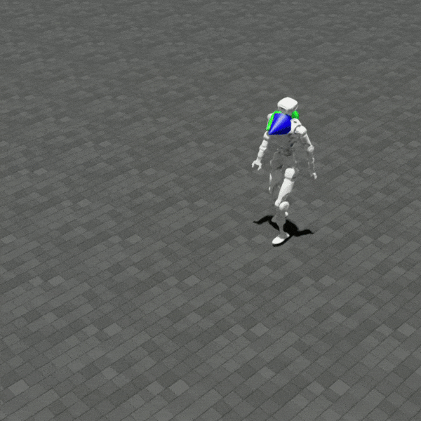
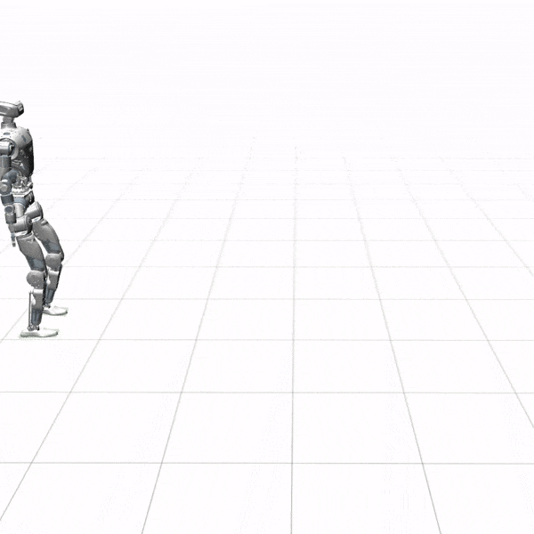
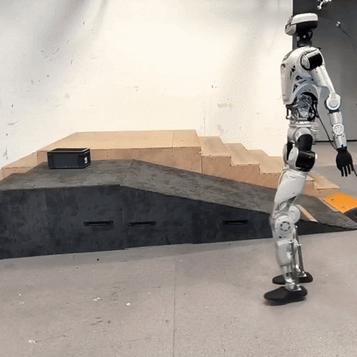
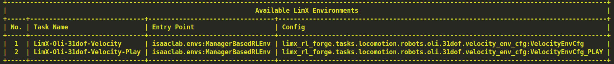

# 中文 | [English](README.md)

# humanoid-rl-isaaclab

   

## 概述
本项目提供了逐际动力 **Oli** 人形机器人的强化学习环境与训练脚本。

<div align="center">

| <div align="center"> Isaac Lab </div> | <div align="center"> Mujoco </div> | <div align="center"> Physical </div> |
|--- | --- | --- |
|  |  |  |
</div>

## 快速开始

### 安装
- 创建 **Python 3.10** 虚拟环境:
``` sh
conda create -n limx python=3.10
conda activate limx
```

- 根据您系统上的 CUDA 版本安装 ​​ **PyTorch 2.5.1**:
``` sh
pip install torch==2.5.1 --index-url https://download.pytorch.org/whl/cu121
```

- 安装 ​​**IsaacSim 4.5.0**​​ 软件包:
``` sh
pip install isaacsim[all,extscache]==4.5.0 --extra-index-url https://pypi.nvidia.com
```

- 从 [IsaacLab官网](https://github.com/isaac-sim/IsaacLab/releases) 下载**2.0.0**版本并安装:
``` sh
./isaaclab.sh -i none
```

- 下载项目代码并安装依赖环境:
``` sh
git clone https://github.com/limxdynamics/limx_rl_forge.git
pip install -r requirements.txt
```

- 下载机器人资产文件：
``` sh
git clone https://github.com/limxdynamics/humanoid-description.git
```

- 验证安装并列出所有可用训练环境:
``` sh
python scripts/list_envs.py
```
Then you will see the following output:


### 训练

- 训练模型
``` sh
python scripts/rsl_rl/train.py --headless --task LimX-Oli-31dof-Velocity
```

- 模型推理
``` sh
python scripts/rsl_rl/play.py --task LimX-Oli-31dof-Velocity
```


## 模型部署

### Sim2Sim

- 运行推理代码并导出模型为`onnx`格式，在模型目录下找到`policy.onnx`文件:
``` sh
python scripts/rsl_rl/play.py --task LimX-Oli-31dof-Velocity --checkpoint path-to-model
```

- 安装 `humanoid-rl-deploy-python` 和 `humanoid-mujoco-sim` 工具箱：
``` sh
mkdir limx_ws
# 下载 MuJoCo 仿真器
git clone --recurse git@github.com:limxdynamics/humanoid-mujoco-sim.git
pip install humanoid-mujoco-sim/limxsdk-lowlevel/python3/amd64/limxsdk-*-py3-none-any.whl
# 下载运动控制算法
git clone git@github.com:limxdynamics/humanoid-rl-deploy-python.git
# 设置机器人型号：如果尚未设置，请按照以下步骤进行设置。
cd ~/limx_ws
tree -L 1 humanoid-rl-deploy-python/controllers
echo 'export ROBOT_TYPE=HU_D03_03' >> ~/.bashrc && source ~/.bashrc # depends on your robot type
```

- 打开一个 Bash 终端并运行仿真环境：
``` sh
python humanoid-mujoco-sim/simulator.py
```

- 把上面得到的 `policy.onnx` 文件放在 `limx_ws/humanoid-rl-deploy-python/controllers/HU_D03_03/walking_controller/policy/default` 目录下. 然后，打开另一个 Bash 终端运行控制算法：
``` sh
python humanoid-rl-deploy-python/main.py
```

- 最后，使用虚拟遥控器来操作机器人. 打开另一个 Bash 终端，运行：
``` sh
./humanoid-mujoco-sim/robot-joystick/robot-joystick
```

- 预定义的控制指令如下:

|**按  键**	| **模式**	| **描述** |
|:-|:-|:-|
|L1+Y|	切换到站立模式|	如果机器人无法站稳，在仿真器中点击 `Reset` 或者按下键盘 `退格键`.
|L1+B|	切换到欢迎模式	|  |
|R2+X| 切换到行走模式 | **这个模式会使用您自己训练的模型!!!** |
|L1+A| 切换到阻尼模式| |
|L1+X| 关闭所有控制器| |


### Sim2Real
- 首先确保您的模型在 `sim2sim` 中能正常运行再进行真机部署！！！
- 启动机器人并按下 `R1+START` 完成校零。
- 确保机器人与您的电脑成功连接（电脑IP设置为`10.192.1.200`，机器人的IP地址固定为`10.192.1.2`，无需设置）；
- 按下 `L1 + START` 切换到开发者模式。注意，开发者模式在机器人重启后仍会保持开启，按下 `L1 + L2 + START` 以退出开发者模式。
- 关闭内置控制器：
``` sh
ssh limx@10.192.1.2
ps -ef | grep "ability"
sudo kill -9 PID
```
- 启动控制算法：
``` sh
python humanoid-rl-deploy-python/main.py 10.192.1.2
```
- 按下 `L1+Y` 让机器人站立。
- 按下 `R1+X` 激活行走模式。
